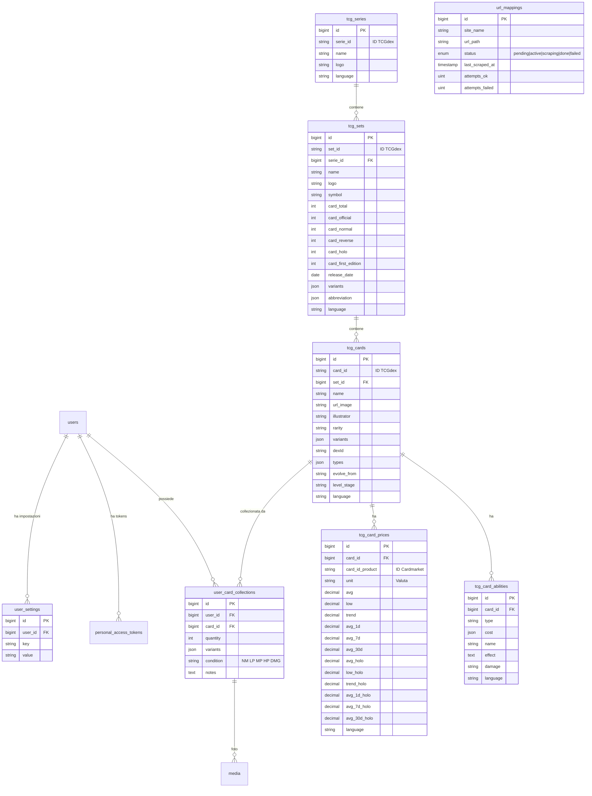

# 🏗️ Architettura del Progetto

## Stack Tecnologico

| Componente | Tecnologia |
|---|---|
| **Framework** | Laravel 13.x (PHP 8.3+) |
| **Frontend** | Blade Templates + Tailwind CSS v4 |
| **Database** | MariaDB |
| **Dati TCG** | [TCGdex PHP SDK](https://github.com/tcgdex/php-sdk) |
| **Auth API** | Laravel Sanctum (Bearer Token) |
| **Auth Web** | Session-based (Laravel default) |
| **Media/Foto** | Spatie Laravel Media Library |
| **Queue** | Laravel Queue (per jobs asincroni) |

## Struttura Cartelle

```
app/
├── Console/Commands/
│   └── FetchPokemonCommand.php       # Import dati da TCGdex
├── Http/
│   ├── Controllers/
│   │   ├── AuthController.php        # API Register/Login/Logout
│   │   ├── AuthWebController.php     # Web Login/Logout
│   │   ├── CollezioniController.php  # Web views per collezioni
│   │   ├── UserSettingsController.php# Web views per impostazioni utente
│   │   └── UserCardCollectionController.php  # CRUD collezione (API)
│   └── Requests/
│       ├── StoreUserCardRequest.php   # Validazione creazione
│       └── UpdateUserCardRequest.php  # Validazione aggiornamento
├── Models/
│   ├── User.php                      # Utente (+ HasApiTokens)
│   ├── TCGSeries.php                 # Serie (es. "Base")
│   ├── TCGSet.php                    # Set (es. "Set Base")
│   ├── TCGCard.php                   # Carta singola
│   ├── TCGCardAbility.php            # Abilità/attacco carta
│   ├── TCGCardPrice.php              # Prezzi Cardmarket
│   ├── UserCardCollection.php        # Collezione utente (+ Spatie Media)
│   └── UrlMapping.php                # Mappatura URL da scrapare
├── Enums/
│   └── UrlMappingStatus.php          # Enum: pending|active|scraping|done|failed
bootstrap/
│   └── app.php                       # Routing (web + api)
routes/
│   ├── web.php
│   ├── api.php                       # API REST
│   └── console.php
database/migrations/
│   ├── 000001_create_tcg_series_table.php
│   ├── 000002_create_tcg_sets_table.php
│   ├── 000003_create_tcg_cards_table.php
│   ├── 000004_create_tcg_card_abilities_table.php
│   ├── 000005_create_tcg_card_prices_table.php
│   ├── 230000_create_user_card_collections_table.php
│   └── *_create_media_table.php      # Spatie Media Library
```

## Schema ER



## Flusso Dati

```
TCGdex API ──► FetchPokemonCommand ──► Database
                                          │
                  ┌───────────────────────┴───────────────────────┐
                  ▼                                               ▼
          API REST (Sanctum Auth)                       Web Routes (Session Auth)
                  │                                               │
                  ▼                                               ▼
      Frontend Mobile / App Esterna                    Blade Views + Tailwind CSS
```

## Dipendenze Composer

| Pacchetto | Versione | Scopo |
|---|---|---|
| `tcgdex/sdk` | ^2.3 | Client PHP per TCGdex API |
| `laravel/sanctum` | ^4.3 | Autenticazione API token |
| `spatie/laravel-medialibrary` | ^11.21 | Upload e conversione foto |
| `kriswallsmith/buzz` | ^1.3 | HTTP client (usato da TCGdex SDK) |
| `nyholm/psr7` | ^1.8 | PSR-7 HTTP messages |
| `symfony/cache` | ^7.4 | Cache layer |
