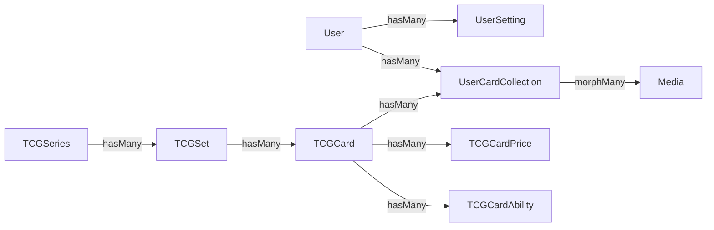

# 🧩 Modelli Eloquent

## Riepilogo Relazioni



---

## `TCGSeries`

**File:** `app/Models/TCGSeries.php`  
**Tabella:** `tcg_series`

### Fillable
`serie_id`, `name`, `logo`, `language`

### Relazioni
| Metodo | Tipo | Target | FK |
|---|---|---|---|
| `sets()` | hasMany | TCGSet | `serie_id` |

---

## `TCGSet`

**File:** `app/Models/TCGSet.php`  
**Tabella:** `tcg_sets`

### Fillable
`set_id`, `serie_id`, `name`, `logo`, `symbol`, `card_total`, `card_official`, `card_normal`, `card_reverse`, `card_holo`, `card_first_edition`, `release_date`, `variants`, `abbreviation`, `language`

### Casts
| Campo | Cast |
|---|---|
| `variants` | array |
| `abbreviation` | array |
| `release_date` | date |

### Relazioni
| Metodo | Tipo | Target | FK |
|---|---|---|---|
| `serie()` | belongsTo | TCGSeries | `serie_id` |
| `cards()` | hasMany | TCGCard | `set_id` |

---

## `TCGCard`

**File:** `app/Models/TCGCard.php`  
**Tabella:** `tcg_cards`

### Fillable
`card_id`, `set_id`, `name`, `url_image`, `illustrator`, `rarity`, `variants`, `dexId`, `types`, `evolve_from`, `level_stage`, `language`

### Casts
| Campo | Cast |
|---|---|
| `variants` | array |
| `types` | array |

### Relazioni
| Metodo | Tipo | Target | FK |
|---|---|---|---|
| `set()` | belongsTo | TCGSet | `set_id` |
| `abilities()` | hasMany | TCGCardAbility | `card_id` |
| `prices()` | hasMany | TCGCardPrice | `card_id` |
| `collectors()` | hasMany | UserCardCollection | `card_id` |

### Metodi Helper
- `getProducedVariantsAttribute()`: Ritorna un array con le stringhe delle varianti effettivamente prodotte per questa carta (estraendo le chiavi con valore `true` dall'oggetto JSON `variants`).

---

## `TCGCardAbility`

**File:** `app/Models/TCGCardAbility.php`  
**Tabella:** `tcg_card_abilities`

### Fillable
`card_id`, `type`, `cost`, `name`, `effect`, `damage`, `language`

### Casts
| Campo | Cast |
|---|---|
| `cost` | array |

### Relazioni
| Metodo | Tipo | Target | FK |
|---|---|---|---|
| `card()` | belongsTo | TCGCard | `card_id` |

### Metodi Statici

#### `createAbilities(int $idCard, array $abilities, string $language): void`

Crea in bulk le abilities/attacks per una carta. Accetta un array di oggetti con proprietà: `type`, `cost`, `name`, `effect`, `damage`.

```php
TCGCardAbility::createAbilities($tcgCard->id, array_merge($card->abilities ?? [], $card->attacks ?? []), 'it');
```

---

## `TCGCardPrice`

**File:** `app/Models/TCGCardPrice.php`  
**Tabella:** `tcg_card_prices`

### Fillable
`card_id`, `card_id_product`, `unit`, `avg`, `low`, `trend`, `avg_1d`, `avg_7d`, `avg_30d`, `avg_holo`, `low_holo`, `trend_holo`, `avg_1d_holo`, `avg_7d_holo`, `avg_30d_holo`, `language`

### Relazioni
| Metodo | Tipo | Target | FK |
|---|---|---|---|
| `card()` | belongsTo | TCGCard | `card_id` |

### Metodi Statici

#### `createPrices(int $idCard, object $pricing, string $language): void`

Crea un record prezzi dal singolo oggetto pricing di Cardmarket. Mappa le chiavi dell'API (con trattini) ai campi del DB (con underscori).

**Mapping chiavi:**
| API TCGdex | DB Column |
|---|---|
| `idProduct` | `card_id_product` |
| `unit` | `unit` |
| `avg1` | `avg_1d` |
| `avg7` | `avg_7d` |
| `avg30` | `avg_30d` |
| `avg-holo` | `avg_holo` |
| `low-holo` | `low_holo` |
| `trend-holo` | `trend_holo` |
| `avg1-holo` | `avg_1d_holo` |
| `avg7-holo` | `avg_7d_holo` |
| `avg30-holo` | `avg_30d_holo` |

---

## `UserCardCollection`

**File:** `app/Models/UserCardCollection.php`  
**Tabella:** `user_card_collections`  
**Implements:** `Spatie\MediaLibrary\HasMedia`

### Fillable
`user_id`, `set_id`, `serie_id`, `card_id`, `quantity`, `variants`, `condition`, `notes`

### Casts
| Campo | Cast |
|---|---|
| `variants` | array |

### Costanti
```php
public const CONDITIONS = ['NM', 'LP', 'MP', 'HP', 'DMG'];
```

### Media Collections
| Collection | MIME Types | Conversioni |
|---|---|---|
| `photos` | jpeg, png, webp | thumb (200×200), preview (600×800) |

### Relazioni
| Metodo | Tipo | Target | FK |
|---|---|---|---|
| `user()` | belongsTo | User | `user_id` |
| `card()` | belongsTo | TCGCard | `card_id` |
| `set()` | belongsTo | TCGSet | `set_id` |
| `serie()` | belongsTo | TCGSeries | `serie_id` |

---

## `User`

**File:** `app/Models/User.php`  
**Traits:** `HasFactory`, `Notifiable`, `HasApiTokens` (Sanctum)

### Relazioni
| Metodo | Tipo | Target | FK |
|---|---|---|---|
| `collection()` | hasMany | UserCardCollection | `user_id` |
| `settings()` | hasMany | UserSetting | `user_id` |

### Metodi Helper
- `getSetting(string $key, $default = null)`: Restituisce il valore di una specifica impostazione.
- `setSetting(string $key, string $value)`: Salva un'impostazione (o la aggiorna se esiste).
- `getLanguageAttribute()`: Ritorna la lingua preferita (`$user->language`).

---

## `UserSetting`

**File:** `app/Models/UserSetting.php`  
**Tabella:** `user_settings`

### Fillable
`user_id`, `key`, `value`

### Relazioni
| Metodo | Tipo | Target | FK |
|---|---|---|---|
| `user()` | belongsTo | User | `user_id` |

---

## `UrlMapping`

**File:** `app/Models/UrlMapping.php`  
**Tabella:** `url_mappings`

Modello che gestisce la coda di URL da scansionare con lo scraper Puppeteer.

### Fillable
`site_name`, `url_path`, `status`, `last_scraped_at`, `attempts_ok`, `attempts_failed`, `type`

### Casts
| Campo | Cast |
|---|---|
| `status` | Enum `UrlMappingStatus::class` |
| `type` | Enum `UrlMappingType::class` |
| `last_scraped_at` | datetime |

### Scope e Metodi Helper
- `scopePending()`, `scopeFailed()`, `scopeDone()`: Filtrano gli URL per stato.
- `markSuccess()`: Segna lo scraping come riuscito e incrementa i tentativi ok.
- `markFailed()`: Segna fallimento e incrementa tentativi falliti.
- `resetToPending()`: Riporta l'URL in coda.

---

## `TCGCardOffer`

**File:** `app/Models/TCGCardOffer.php`  
**Tabella:** `tcg_card_offers`

Rappresenta le singole offerte di mercato trovate online per una carta.

### Fillable
`card_id`, `article_id`, `seller_name`, `seller_profile_url`, `seller_country`, `seller_sales_count`, `seller_available_items`, `card_condition`, `card_condition_code`, `card_language`, `is_reverse_holo`, `is_holo`, `card_special_type`, `seller_comment`, `price_eur`, `quantity`

### Casts
- Booleani per holo (`is_holo`, `is_reverse_holo`)
- Decimal per prezzo (`price_eur` -> `decimal:2`)
- Interi per vendite e quantità.

### Relazioni
| Metodo | Tipo | Target | FK |
|---|---|---|---|
| `card()` | belongsTo | TCGCard | `card_id` |
