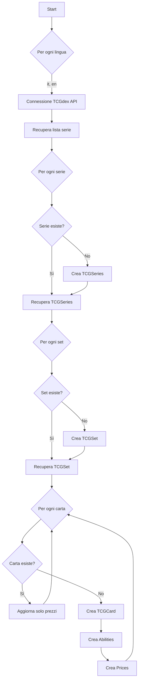

# 📥 Importazione Dati — FetchPokemonCommand

## Comando

```bash
php artisan app:fetch-pokemon
```

**File:** `app/Console/Commands/FetchPokemonCommand.php`

## Descrizione

Importa tutte le carte Pokémon TCG dall'API TCGdex in due lingue (italiano e inglese, in questo ordine). Popola le tabelle: `tcg_series`, `tcg_sets`, `tcg_cards`, `tcg_card_abilities` e `tcg_card_prices`.

## Flusso di Esecuzione



## Logica di Deduplicazione

| Entità | Criterio di unicità | Comportamento se esiste |
|---|---|---|
| Serie | `serie_id` + `language` | Skip, riusa ID auto-increment |
| Set | `set_id` + `language` | Skip, riusa ID auto-increment |
| Carta | `card_id` + `set_id` | Aggiorna solo prezzi |

## Foreign Keys

Il comando usa gli **ID auto-increment** come FK tra le tabelle, non gli ID stringa di TCGdex:

```php
// Serie → Set: usa l'auto-increment ID della serie
$tcgSet->serie_id = $tcgSerie->id;

// Set → Card: usa l'auto-increment ID del set
$tcgCard->set_id = $tcgSet->id;

// Card → Abilities/Prices: usa l'auto-increment ID della carta
TCGCardAbility::createAbilities($tcgCard->id, ...);
TCGCardPrice::createPrices($tcgCard->id, ...);
```

## Gestione null safety

Il comando gestisce campi potenzialmente null dall'API:

```php
// Abilities e attacks possono essere null
array_merge($card->abilities ?? [], $card->attacks ?? [])

// Abbreviation del set può essere null
$tcgSet->abbreviation = $set->abbreviation ?? '-';
```

## Output

Il comando stampa informazioni di progresso durante l'esecuzione:

```
Language: it
Serie: Base
Set: Set Base
Inserisco Set: Set Base
Card: Alakazam
Inserisco Card: Alakazam (base1-1)
Card: Blastoise
Aggiorno Prezzi: Blastoise (base1-2)
```

## Considerazioni

- **Tempo di esecuzione**: l'import completo può richiedere diversi minuti poiché fa una chiamata API per ogni serie, set e carta.
- **Rate limiting**: non implementato, l'API TCGdex non ha limiti noti ma è consigliabile non lanciare il comando troppo frequentemente.
- **Riesecuzione**: è safe ri-eseguire il comando — le entità esistenti vengono saltate (tranne i prezzi che vengono ri-creati).
- **Errori**: al momento non c'è gestione degli errori per singole carte. Un errore su una carta interrompe l'intero processo.
