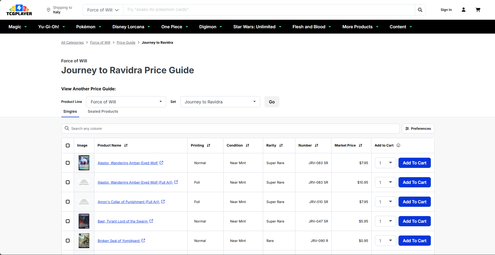
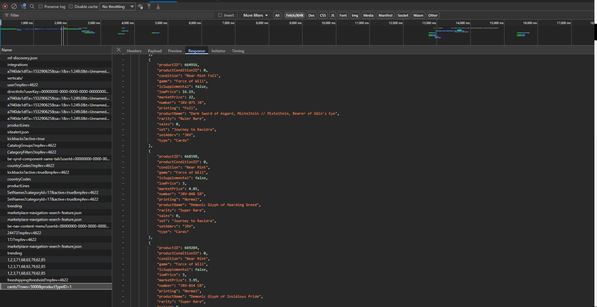

# 🎴 Card Scanner - Guida Completa Utente

**Versione:** 2.0  
**Ultimo aggiornamento:** 5 Gennaio 2026

---

## ⚖️ Informazioni Legali

> [!CAUTION]
> **Uso Privato e Non Commerciale**
> 
> Questa applicazione è rilasciata **esclusivamente per uso personale e privato**. È **severamente vietato** l'utilizzo per scopi commerciali, la rivendita del servizio o qualsiasi altra attività che generi profitto diretto o indiretto.
> 
> L'uso commerciale non autorizzato viola i termini di licenza e può comportare azioni legali.

---

## 🌐 Demo Online Disponibile

Puoi provare l'applicazione gratuitamente al seguente indirizzo:

**🔗 [https://gmapsextractor.altervista.org/](https://gmapsextractor.altervista.org/)**

> [!IMPORTANT]
> **Reset Automatico Giornaliero**
> 
> L'istanza demo viene **automaticamente azzerata ogni giorno alle ore 00:00** (mezzanotte). Tutti i dati relativi alle carte, collezioni e market data vengono eliminati per evitare il saturamento delle risorse del server.
> 
> **Non utilizzare la demo per archiviare dati importanti a lungo termine!** Se desideri conservare la tua collezione in modo permanente, installa l'applicazione sul tuo server personale seguendo le istruzioni nel file `README.md`.

---

## 📖 Cos'è Card Scanner?

Card Scanner è un'applicazione web progettata per aiutarti a:

- 📊 **Catalogare** la tua collezione di carte collezionabili (Pokemon, Magic, Yu-Gi-Oh!, etc.)
- 🤖 **Riconoscere automaticamente** le informazioni stampate sulle carte tramite AI
- 💰 **Monitorare il valore** delle tue carte utilizzando dati di mercato
- 📈 **Calcolare profitti e perdite** della tua collezione

---

## 🚀 Come Funziona: Processo Completo

### Il Flusso in 3 Passi

```
1. IMPORTA MARKET DATA → 2. SCANSIONA E SALVA CARTE → 3. MONITORA VALORE
```

---

## 1️⃣ Market Data: Importare i Prezzi delle Carte

### 📌 Perché è Importante?

I **Market Data** sono i dati di mercato che contengono i prezzi aggiornati delle carte. Senza questi dati, l'applicazione non può calcolare il valore della tua collezione.

> [!TIP]
> Importa i Market Data **una volta per ogni set** di carte che possiedi. Non è necessario farlo per ogni singola carta.

---

### 🔍 Come Recuperare i Market Data da TCGPlayer

I dati di mercato vengono recuperati manualmente dal sito **TCGPlayer**. Segue una guida dettagliata.

> [!NOTE]
> **Perché Manualmente?**
> 
> La procedura è manuale per evitare di infrangere i limiti di scraping e i termini di servizio del sito TCGPlayer. Tuttavia, se lo desideri, sei libero di automatizzare questo processo modificando l'applicazione e aggiungendo un comando personalizzato.

---

#### **Passo 1: Naviga sul Sito TCGPlayer**

1. Vai su: **[https://www.tcgplayer.com/categories/trading-and-collectible-card-games](https://www.tcgplayer.com/categories/trading-and-collectible-card-games)**
2. Troverai una lista di tutti i giochi di carte disponibili (Pokemon, Magic, Yu-Gi-Oh!, etc.)
3. **Clicca sul gioco** di tuo interesse

---

#### **Passo 2: Seleziona il Set**

1. Dopo aver selezionato il gioco, vedrai una lista di **set disponibili**
2. Naviga e trova il set che ti interessa
3. **Clicca sul set** per visualizzare le carte

---

#### **Passo 3: Apri gli Strumenti per Sviluppatori (DevTools)**

Ora dovrai accedere alla **Console per Sviluppatori** del tuo browser. Questa è una funzionalità presente in tutti i browser moderni che permette di vedere le comunicazioni tra il sito web e il server.

**Come aprirla:**

- **Windows/Linux:** Premi `F12` sulla tastiera
- **Mac:** Premi `Cmd + Option + I`
- **Alternativa:** Fai click destro sulla pagina → Seleziona **"Ispeziona"** o **"Inspect Element"**

Si aprirà un pannello nella parte inferiore o laterale del browser con diverse schede.

> [!NOTE]
> **Cos'è la Console per Sviluppatori?**
> 
> È uno strumento integrato nei browser (Chrome, Firefox, Edge, Safari) che permette agli sviluppatori di analizzare il codice delle pagine web, visualizzare errori e monitorare le comunicazioni di rete. In questo caso, la useremo per "intercettare" i dati che TCGPlayer carica nella tabella dei prezzi.

---

#### **Passo 4: Vai al Tab "Network"**

1. Nella console, clicca sulla scheda **"Network"** (o **"Rete"** in italiano)
2. Questa scheda mostra tutte le richieste HTTP che il sito effettua

---

#### **Passo 5: Carica il Price Guide**

1. Torna alla pagina web (senza chiudere la console)
2. Clicca sul pulsante **"View the price guide"**
3. Attendi che la tabella con le carte e i prezzi si carichi completamente



---

#### **Passo 6: Trova la Richiesta /cards nella Console**

1. Torna alla **Console → Tab "Network"**
2. In alto, attiva il filtro **"Fetch/XHR"** (clicca su questa voce per filtrare solo le richieste API)
3. Nella lista di richieste, cerca una chiamata che inizia con **`/cards?...`**
4. **Clicca DUE volte** sull'**ultima richiesta** `/cards?...` (quella più recente in fondo alla lista)

> [!TIP]
> L'ultima richiesta `/cards?...` contiene esattamente i dati che stai vedendo nella tabella web!

---

#### **Passo 7: Copia la Response**

1. Si aprirà un pannello laterale sulla sinistra (o destra, a seconda del browser)
2. Clicca sulla scheda **"Response"** (o **"Risposta"**)
3. Vedrai del testo in formato JSON (una struttura dati con parentesi graffe e virgolette)
4. **Seleziona TUTTO il contenuto** (puoi usare `Ctrl+A` o `Cmd+A`)
5. **Copia il testo** (`Ctrl+C` o `Cmd+C`)



---

#### **Passo 8: Salva il File JSON**

1. Apri **Blocco Note** (Windows) o **TextEdit** (Mac) o qualsiasi editor di testo
2. **Incolla** il contenuto copiato (`Ctrl+V` o `Cmd+V`)
3. Vai su **File → Salva con nome**
4. Scegli un nome che ricordi il set, ad esempio: `pokemon-journey-to-ravidra.json`
5. **Importante:** Assicurati che l'estensione sia `.json` (non `.txt`)
6. Salva il file

---

### 📤 Importare i Market Data nell'Applicazione

Ora che hai il file JSON, puoi caricarlo nell'applicazione:

1. Accedi a **Card Scanner**
2. Vai alla sezione **"Market Data"** (dal menu di navigazione)
3. Clicca sul pulsante **"Importa Market Data"**
4. Seleziona il file `.json` che hai appena salvato
5. Clicca **"Carica"** (o "Upload")
6. Attendi il completamento dell'importazione

> [!IMPORTANT]
> L'importazione può richiedere alcuni secondi o minuti a seconda della dimensione del set. **Non chiudere la pagina** durante il processo!

Una volta completata, vedrai un messaggio di conferma e il numero di carte importate.

---

## 2️⃣ Scansionare le Tue Carte

### 📸 Processo di Upload e Riconoscimento

1. **Vai alla sezione "Scansiona"** (icona fotocamera nel menu)

2. **Carica le Foto delle Tue Carte:**
   - Trascina le immagini nell'area di upload, oppure
   - Clicca per selezionare i file dal tuo computer
   - Puoi caricare **più carte contemporaneamente**

3. **Ritaglia (Opzionale):**
   - Per ogni carta caricata, puoi cliccare **"Ritaglia"**
   - Inquadra solo la carta eliminando lo sfondo
   - Oppure clicca **"Salta Ritaglio"** per usare l'immagine originale

4. **Riconoscimento AI:**
   - Clicca l'icona **"bacchetta magica"** 🪄 (o "Riconosci con AI")
   - L'intelligenza artificiale **Google Gemini** analizzerà l'immagine
   - L'AI estrae **solo i dati visibili sulla carta**:
     - Nome della carta
     - HP (punti vita)
     - Tipo (Fuoco, Acqua, Erba, etc.)
     - Attacchi e abilità
     - Rarità
     - Numero carta (es. 063/094)
     - **Gioco di appartenenza** (Pokemon, Magic, Yu-Gi-Oh!, etc.)
   
> [!NOTE]
> **Cosa NON fa l'AI?**
> 
> L'AI **NON** riconosce automaticamente il **Set di appartenenza** della carta. Questo perché molte carte non hanno il nome del set stampato in modo chiaro. Il set verrà assegnato **manualmente** nella fase successiva.

5. **Verifica i Dati:**
   - Controlla che i dati estratti siano corretti
   - Puoi modificare manualmente qualsiasi campo se necessario

6. **Salva la Carta:**
   - Clicca **"Salva"**
   - La carta viene salvata nel database come **"Ready"** (Pronta)

---

### 🎮 Riconoscimento Automatico del Gioco

L'AI è in grado di riconoscere automaticamente a quale **gioco** appartiene la carta (Pokemon, Magic: The Gathering, Yu-Gi-Oh!, Force of Will, etc.).

**Cosa succede:**
- Se il gioco è già presente nella tua collezione, la carta viene associata ad esso
- Se è un **nuovo gioco**, viene automaticamente creato nella lista dei tuoi giochi

Questo ti permette di gestire collezioni di **più giochi diversi** nella stessa applicazione!

---

### 🗑️ Gestione Carte Durante l'Upload

Durante il processo di upload, hai diverse opzioni:

- **Elimina Singola Carta:** Clicca l'icona cestino 🗑️ per rimuovere una carta errata
- **Svuota Tutto:** Elimina tutte le carte caricate (⚠️ **azione permanente!**)

> [!WARNING]
> Il pulsante **"Svuota Tutto"** elimina **definitivamente** tutte le carte visualizzate, rimuovendole sia dal database che dallo storage fisico del server. Usalo con cautela!

---

## 3️⃣ Gestire la Collezione

Dopo aver salvato le carte, vai alla sezione **"Collezione"** per visualizzarle e organizzarle.

### 🏷️ Assegnare il Set

Questa è la fase cruciale in cui assegni manualmente il **Set di appartenenza** a ciascuna carta:

1. Nella sezione **Collezione**, troverai tutte le tue carte
2. Per ogni carta, clicca sull'icona **matita** ✏️ (Modifica)
3. Si aprirà un form di modifica
4. Seleziona il **Set** dal menu a tendina
5. Seleziona la **Condizione** della carta:
   - **Near Mint (NM)**: Come nuova
   - **Lightly Played (LP)**: Leggermente usata
   - **Moderately Played (MP)**: Mediamente usata
   - **Heavily Played (HP)**: Molto usata
   - **Damaged (DMG)**: Danneggiata
6. Clicca **"Salva"**

> [!TIP]
> **Perché la condizione è importante?**
> 
> Il valore di mercato di una carta varia significativamente in base alla sua condizione. Una carta Near Mint vale molto di più della stessa carta Heavily Played!

---

### 📋 Altre Funzionalità della Collezione

- **Espandi/Comprimi Set:** Clicca sull'intestazione di un set per espandere o comprimere la vista
- **Visualizza Dettagli:** Clicca sull'icona occhio 👁️ per vedere tutti i dettagli
- **Elimina Carta:** Clicca sull'icona cestino 🗑️ per eliminare definitivamente
- **Zoom Immagine:** Clicca sull'immagine della carta per vederla a schermo intero

---

### ✅ Selezione Multipla

Puoi gestire più carte contemporaneamente:

1. Spunta le **checkbox** accanto alle carte che vuoi selezionare
2. Apparirà una **barra di azioni** in fondo alla pagina
3. Usa le azioni disponibili:
   - **"Assegna Set"**: Assegna tutte le carte selezionate allo stesso set
   - **"Analizza Selezionati"**: Lancia l'AI su più carte
   - **"Conferma Selezionati"**: Salva multiple carte

---

## 4️⃣ Collegare le Carte ai Prezzi (Matching)

Una volta assegnato il set, puoi collegare le tue carte ai **Market Data** per calcolare il valore.

1. Vai alla sezione **"Matching"**
2. Clicca **"Auto-Match"** per il matching automatico
3. L'applicazione cerca di abbinare automaticamente le tue carte ai dati di mercato utilizzando:
   - Nome carta
   - Numero carta
   - Set

4. **Per carte non abbinate automaticamente:**
   - Clicca sulla carta
   - Vedrai una lista di suggerimenti
   - Seleziona la corrispondenza corretta
   - Conferma il match

---

## 5️⃣ Monitorare il Valore della Collezione

Vai alla sezione **"Valore"** per visualizzare statistiche sulla tua collezione:

- **Valore Corrente Totale**: Quanto vale la tua collezione oggi
- **Prezzo di Acquisto**: Quanto hai speso in totale
- **Profitto/Perdita (P&L)**: Differenza tra valore attuale e prezzo di acquisto
  - In **Euro (€)**
  - In **Percentuale (%)**
- **Tabella Dettagliata**: Ogni carta con il suo valore individuale

> [!TIP]
> Aggiorna periodicamente i Market Data per avere prezzi sempre attuali!

---

## 📱 Profilo Utente

Clicca sul tuo **avatar** in alto a destra per accedere a:

- **Il Mio Profilo**: Modifica nome, email e dati personali
- **Cambia Password**: Aggiorna la tua password
- **Esci**: Disconnettiti dall'applicazione

---

## 💡 Consigli per Risultati Migliori

### 📸 Per Foto di Qualità

- ✅ Usa **illuminazione naturale** e uniforme
- ✅ Sfondo **semplice** (bianco, nero o superficie neutra)
- ✅ Evita **riflessi** sulla carta (non usare flash diretto)
- ✅ Tieni la fotocamera **parallela** alla carta (non inclinata)
- ✅ Assicurati che la foto sia **nitida** (non mossa o sfocata)

### 🤖 Per Riconoscimento AI Ottimale

- ✅ Carte in **lingua inglese** (l'AI è più precisa)
- ✅ **Inquadra solo la carta**, elimina lo sfondo
- ✅ Carte con testo **leggibile** (non rovinate o sbiadite)
- ✅ Se l'AI sbaglia, **modifica manualmente** i dati

### 🗂️ Per Organizzare la Collezione

- 📁 **Assegna sempre il set corretto**: è fondamentale per il matching
- 🏷️ **Indica la condizione reale**: influisce sul valore di mercato
- 🔄 **Aggiorna i Market Data** periodicamente (ogni mese o quando escono nuovi set)
- 💾 **Salva regolarmente**: non perdere il lavoro fatto

---

## ❓ Domande Frequenti

### Posso usare l'app per carte di giochi diversi?

**Sì!** L'applicazione supporta **tutti i giochi di carte collezionabili**. L'AI riconosce automaticamente il gioco e puoi gestire collezioni multiple.

---

### L'AI può sbagliare?

**Sì**, nessuna AI è perfetta al 100%. Controlla sempre i dati estratti e modifica manualmente se necessario.

---

### Cosa succede se non trovo il set giusto?

Se il set non è disponibile, assicurati di aver importato i **Market Data** corretti per quel set specifico.

---

### Posso automatizzare l'importazione dei Market Data?

Sì, sei libero di modificare l'applicazione come preferisci. Puoi creare un comando Artisan personalizzato che effettua scraping automatico, ma ricorda di rispettare i limiti e i termini di servizio di TCGPlayer.

---

### Quanto costa usare l'applicazione?

L'applicazione è **completamente gratuita** e open source. Devi solo:
- Pagare per l'**API key di Google Gemini** (ha un piano gratuito molto generoso)
- Eventualmente pagare l'**hosting** se vuoi metterla online

---

### Posso condividere con amici?

Sì! Ogni utente ha la propria collezione **privata e separata**. Puoi installare l'app su un server e invitare altri collezionisti.

---

## 🔧 Problemi Comuni

### "L'AI non riconosce la carta"

**Soluzioni:**
- Verifica la **qualità della foto**
- Assicurati che il testo sia **leggibile**
- Riprova con **illuminazione migliore**
- Usa l'**inserimento manuale** come alternativa

---

### "Il matching non trova corrispondenze"

**Soluzioni:**
- Verifica di aver **importato i Market Data** del set corretto
- Controlla il **numero carta** (formato es. "063/094")
- Assicurati che il **nome** sia esatto
- Usa il **match manuale**

---

### "Non riesco a trovare la richiesta /cards nella console"

**Soluzioni:**
- Assicurati di aver attivato il filtro **"Fetch/XHR"**
- **Ricarica** la pagina del Price Guide
- Verifica di aver cliccato su **"View the price guide"**

---

### "Il file JSON non viene importato"

**Soluzioni:**
- Verifica che l'estensione sia **`.json`** (non `.txt`)
- Assicurati di aver copiato **tutto il contenuto** dalla Response
- Controlla che il file non sia **vuoto**

---

## 🆘 Supporto

Se hai problemi o domande non coperte da questa guida:

1. Controlla i **log degli errori** in `storage/logs/laravel.log` (se hai installato l'app localmente)
2. Verifica di aver seguito **tutti i passaggi** correttamente
3. Apri una **issue** su GitHub
4. Contatta il supporto via email

---

## 🎉 Buon Collezionismo!

Ora hai tutte le informazioni necessarie per sfruttare al massimo **Card Scanner**!

**Ricorda:**
- 📸 Fai sempre foto di qualità
- 🏷️ Assegna correttamente set e condizione
- 🔄 Aggiorna i prezzi periodicamente
- 💾 Salva regolarmente i dati
- 🎴 Divertiti a collezionare!

---

**Developed with ❤️ for collectors worldwide**
